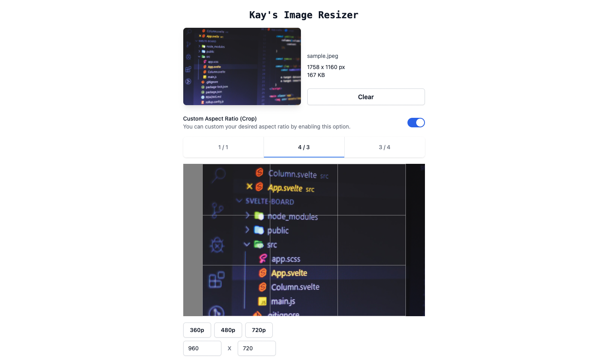

# Kay's Image Resizer

## Live Web App

You can see [the live web app (PWA) here](https://img.kay.kr) which is deployed via [Vercel](https://vercel.com).

This website has been created by `create-next-app` with [this template](https://github.com/coxwave/nextjs-template).

## Features

- In browser resize (which means...)
- There's _no size limit_ for input image.
- No need for network connection. (if downloaded)
- Easy cropping UX using [react-easy-crop](https://github.com/ricardo-ch/react-easy-crop).
- Supported input image formats: `['.webp', '.jpeg', '.jpg', '.png']`
- Supported output image formats: `['image/webp', 'image/jpeg', 'image/png']`

## Roadmap

- Add support for server-side resize (using [sharp](https://sharp.pixelplumbing.com))
- Add support for making placeholder blurred image which can used within [next/image](https://nextjs.org/docs/api-reference/next/image).

## Issues

- Please [open an issue](https://github.com/kayk1m/img.kay.kr/issues/new/choose) with a description as detailed as possible.

## Contribution

- You can fork this repository and open a pull request. It would be awesome! 👍
